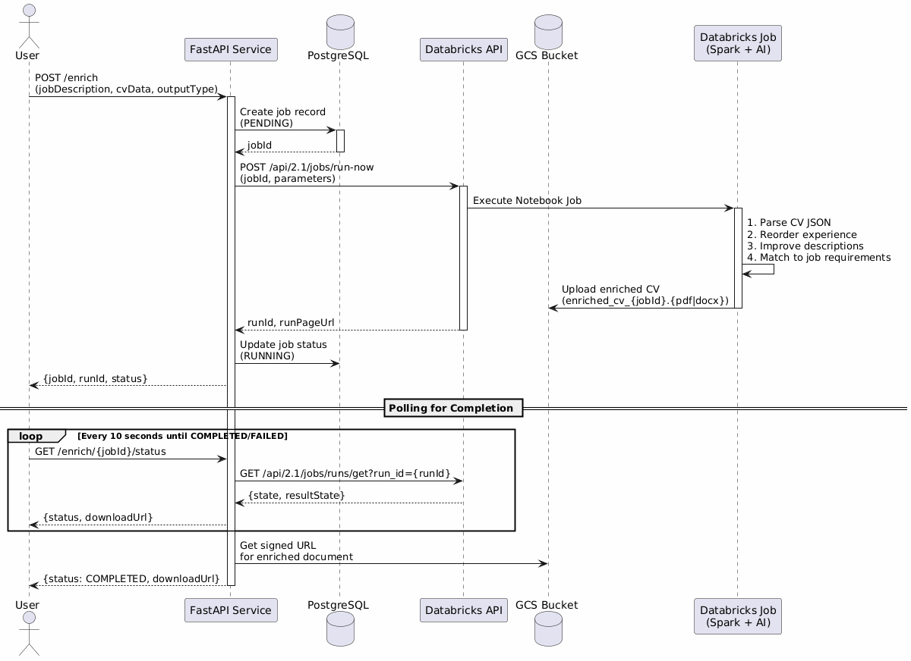

# CV Enrichment Service - MVP Documentation

## Overview

This folder contains the technical documentation for the CV Enrichment Service MVP, updated based on discussions with Lead and Product Owner.

### What This Service Does

The service **enriches CVs** based on job descriptions by:
1. Reordering experience to highlight relevant skills
2. Improving descriptions while keeping all original facts
3. Matching content to job requirements
4. Generating professionally formatted PDF/DOCX documents

### Key Constraints

| Constraint | Value |
|------------|-------|
| No fabrication | All content based on original CV |
| 3 input parameters | jobDescription, greenhouseParseData, jsonCvTextExtracted |
| 2 output formats | PDF (type=1) or DOCX (type=2) |
| Independent service | Can be consumed by multiple systems |
| Auth in future phase | OAuth 2.0 (clientId + clientSecret) |

---
## Sequence Diagram: Full Enrichment Flow


---

## Technology Stack

| Component | Technology | Reason |
|-----------|------------|--------|
| API Framework | FastAPI | Fast, async, automatic docs |
| Database | PostgreSQL | Job tracking, metadata |
| Databricks | Spark + AI | Existing infrastructure |
| Cloud Storage | GCS | Google Workspace integration |
| Document Gen | python-docx, ReportLab | PDF/DOCX generation |
| Auth (Future) | OAuth 2.0 | Industry standard |

---

## Databricks Job Integration

### Architecture Overview



### Job Trigger Flow

1. **API receives enrichment request** with job description, CV data, and output type
2. **API creates job record** in PostgreSQL with status `PENDING`
3. **API triggers Databricks job** via `POST /api/2.1/jobs/run-now`
4. **Databricks executes notebook** with Spark + AI processing
5. **Polling for completion** every 10 seconds via `GET /api/2.1/jobs/runs/get`
6. **GCS signed URL** returned for download

### Databricks Notebook Logic

```python
# Step 1: Parse CV JSON
parsed_cv = parse_cv_json(cv_data)

# Step 2: Reorder experience by relevance
reordered_experience = reorder_experience(
    cv=parsed_cv,
    job_description=job_description
)

# Step 3: Improve descriptions using AI
enriched_experience = enrich_descriptions(
    experience=reordered_experience,
    job_requirements=job_description
)

# Step 4: Generate document (PDF/DOCX)
output_filename = f"enriched_cv_{job_id}.{'pdf' if output_type == 1 else 'docx'}"

# Step 5: Upload to GCS
gcs_path = upload_to_gcs(local_file, bucket, destination)
```

### Authentication & Token Requirements

| Aspect | Details |
|--------|---------|
| **Token Type** | Databricks Personal Access Token (PAT) |
| **Required Scopes** | `workspace`, `jobs`, `secrets` |
| **Storage** | Environment variable (dev) / Databricks Secret Scope (prod) |
| **API Header** | `Authorization: Bearer {DATABRICKS_TOKEN}` |

```python
# All Databricks API calls require Bearer token
headers = {
    "Authorization": f"Bearer {DATABRICKS_TOKEN}",
    "Content-Type": "application/json"
}
```

### Job Configuration

```json
{
    "job_id": 123456,
    "settings": {
        "name": "cv-enrichment-job",
        "tasks": [{
            "task_key": "enrich_cv",
            "notebook_task": {
                "notebook_path": "/Repos/service-account/cv-enrichment/notebooks/enrich.ipynb"
            },
            "existing_cluster_id": "1234-567890-abcdef01"
        }],
        "timeout_seconds": 600,
        "max_retries": 2
    }
}
```

### Error Handling

| Error Type | Handling |
|------------|----------|
| API timeout | Retry with exponential backoff (max 3 attempts) |
| Job failure | Mark as FAILED, return error details |
| Token expired | Return 401, trigger re-authentication |
| LLM failure | Fallback to non-enriched CV with warning |

---

## Next Steps

1. **Validate with Databricks team**: Confirm job configuration approach
2. **Design CV template**: Create company-standard CV format
3. **Set up GCS bucket**: Configure storage for documents
4. **Develop Databricks notebook**: Implement enrichment logic
5. **Build API service**: Implement FastAPI service

---