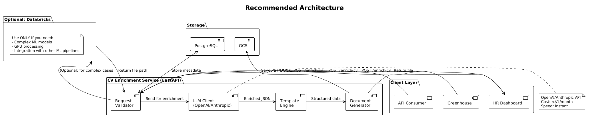

# CV Enrichment Service - Personal Recommendation

## Executive Summary

After analyzing your requirements and existing infrastructure (Databricks, ~300 employees, 20 hires/month), here is my honest recommendation:

> **The proposed architecture is feasible, but consider whether Databricks is the right tool for this specific job.**

---

## Feasibility Assessment

### What You Want to Build ✅

| Component | Feasible? | Notes |
|-----------|-----------|-------|
| FastAPI service as entry point | ✅ Yes | Standard choice |
| Consume Databricks job | ✅ Yes | With caveats |
| Return PDF/DOCX | ✅ Yes | But not from Databricks directly |
| OAuth authentication | ✅ Yes | Standard implementation |
| Google Drive integration | ✅ Yes | Optional add-on |

### The Databricks Caveat

**Databricks Jobs CANNOT return binary files directly.**

**Your architecture must include:**
1. Databricks generates document and saves to S3/GCS/DBFS
2. Databricks returns file path (string) to your API
3. Your API downloads from cloud storage
4. Your API returns to client

---

## Recommendation: Consider Alternatives

### Why Databricks Might Be Overkill

| Factor | Your Company | Typical Databricks Use Case |
|--------|--------------|------------------------------|
| Company size | 300 employees | Enterprise (1000+ employees) |
| Hires/month | ~20 CVs | Data pipelines (millions of rows) |
| Team skills | Generalists | Data Engineers |
| Existing jobs | Many | Maybe few |

### Cost Comparison

### Real Cost Numbers

| Solution | Monthly Cost | Setup Complexity | Maintenance |
|----------|-------------|------------------|-------------|
| Databricks (Serverless) | $5-20 | High | Medium |
| Databricks (Jobs Compute) | $20-50 | Medium | High |
| OpenAI API | <$1 | Low | Low |
| Anthropic API | <$1 | Low | Low |
| No LLM (reformat only) | $0 | Very Low | Minimal |

---

## Still Want Databricks ?

### When Databricks Makes Sense

Databricks IS the right choice if:

| Scenario | Why Databricks |
|----------|----------------|
| You have existing ML pipelines | Reuse infrastructure |
| CV enrichment needs complex ML | Fine-tuning, embeddings |
| Multiple teams use Databricks | Shared resources |
| You need GPU for processing | Native GPU support |

### When Databricks Doesn't Make Sense

Databricks is OVERENGINEERED if:

| Scenario | Better Alternative |
|----------|---------------------|
| Simple text enrichment | Direct LLM API call |
| CV reformatting | Template engine |
| Basic transformation | Python in API service |
| Low volume (20/month) | Serverless functions |

---

## Suggested Architecture

### Recommended Approach: Hybrid

### Why This Architecture?

| Component | Choice | Reason |
|-----------|--------|--------|
| API Service | FastAPI | Fast, async, easy to maintain |
| LLM | OpenAI/Anthropic | Cheaper, faster than Databricks for this use case |
| Storage | GCS | Cheapest, good integration |
| Database | PostgreSQL | Simple job tracking |

### What This Architecture Skips

| Skipped | Why |
|---------|-----|
| Databricks (for basic enrichment) | Overkill for simple text transformation |
| Complex async queue | Not needed for 20/month volume |
| SQS/SNS | Adds complexity without benefit |

---

## Decision Matrix

| Question | Your Answer | Implication |
|----------|-------------|-------------|
| Do you have existing Databricks infrastructure? | Probably yes | Good candidate for Databricks |
| Do you have data engineers to maintain? | Unknown | Need dedicated team |
| Is enrichment complex (ML/AI)? | Text only (likely) | Databricks overkill |
| Do you need GPU? | Probably not | Databricks overkill |
| Volume (CVs/month) | ~20 | Low volume, simple solution works |

---

## Final Recommendation

### If Databricks is Required (Company Policy)

✅ **Proceed with Databricks architecture** as documented in:
- `docs/proposal/proposal.md`

**Just be aware:**
- Adds complexity
- Higher cost
- Slower cold starts
- More maintenance

### If You Have Flexibility

⚡ **Consider direct LLM approach:**

1. **Lower cost**: ~$0/month vs $20+/month
2. **Faster development**: 2-3 weeks vs 6-8 weeks
3. **Simpler maintenance**: No Databricks cluster management
4. **Better performance**: No cold start delays

**The LLM can still:**
- Reorder experience by job relevance
- Improve descriptions (without fabricating)
- Highlight matching skills
- Keep all original facts intact

---

## What I'd Build

### This Approach Gets You

| Deliverable | Timeline |
|-------------|----------|
| Working API | Week 2 |
| Basic enrichment | Week 2 |
| PDF generation | Week 2 |
| GCS storage | Week 2 |
| Testing complete | Week 3 |
| In production | Week 4 |

### Then, Based on Feedback

| If... | Then... |
|-------|---------|
| HR loves it | Add more features |
| HR wants more AI | Upgrade to better LLM |
| Volume increases | Add caching, async processing |
| Need ML features | Add Databricks for that specific need |
| Want Drive upload | Add Phase 2 (Google Drive) |

---

## Conclusion

**The architecture you described is feasible**, but may be overengineered for your actual needs.

**My recommendation:**
1. Start simple (direct LLM + templates)
2. Prove value with HR team
3. Add complexity only if needed
